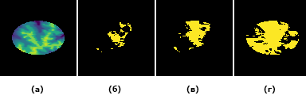
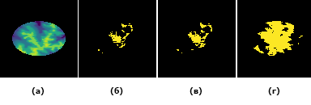

# RadioCoverageZone
Метод построения зон покрытия радиопередающих устройств на местности с учетом зон Френеля

(а) - матрица высот местности, Подъем над землей: (б) - 10 м, (в) - 30 м, (г) - 60 м

(а) - матрица высот местности, Длина волны: (б) - 10 мкм, (в) - 10 см, (г) - 100 м

Трехмерная визуализация зон покрытия передатчиков. (а) - 10 мкм, (б) - 100 м
